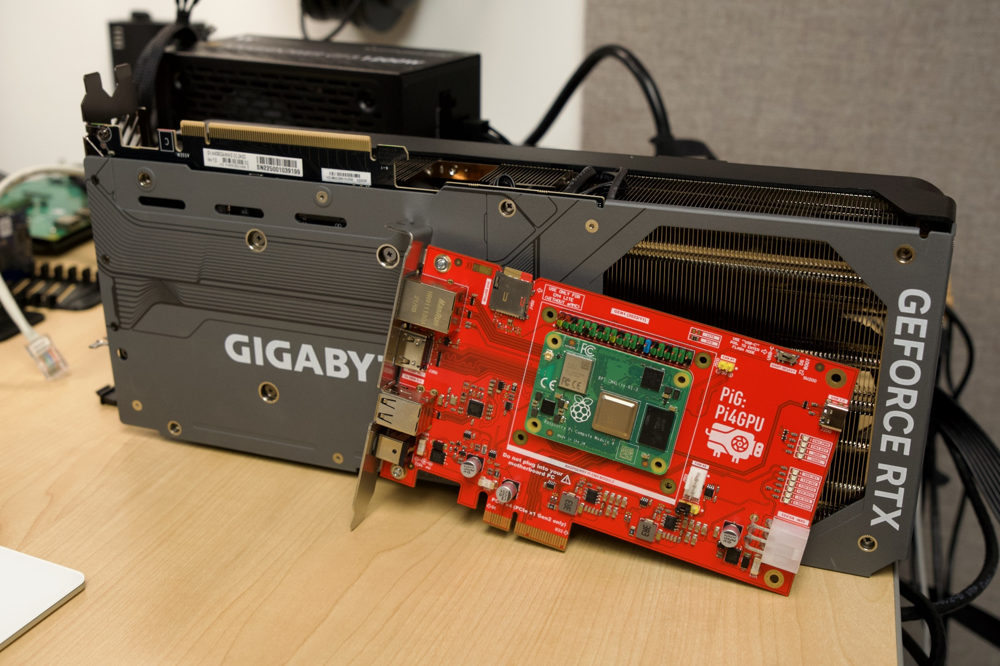

# Pi4GPU - Raspberry Pi CM4 GPU Carrier Board

_a.k.a. 'PiG'_

This project contains the code and designs for a carrier board intended to unite a Raspberry Pi Compute Module 4 to any manufacturer's GPU.

The board is not exclusively intended for GPU testing, though—this project is helpful for testing any kind of full-size PCI Express card with a Raspberry Pi Compute Module 4 or any CM4-compatible System on Modules (SoM).

## Goals

This project includes all the design files to build the Pi4GPU project:

  - **CM4 carrier board** (with PCIe x4 edge connection)
    - 1x full-size HDMI (rear)
    - 1x RJ45 Ethernet (rear)
    - 2x USB 2.0 (rear)
    - 1x 12v barrel power plug (rear)
    - 1x microSD card slot for Lite CM4 (top)
    - 4-pin PWM fan header with EMC2301 fan controller for optional fan (possibly)
  - **PCIe adapter board**
    - 1x x4 (x1 signaling) PCI Express slot for CM4 carrier board
    - 1x x16 (x1 signaling) PCI Express slot for GPU or other device
  - **3D printed stand**
    - Stable base for the Carrier board, extends to support 3+ slot GPUs
    - Mounting points for PCIe card brackets (in the future)

## Current Status

Early prototype. It works, but there are plenty of improvements to be made! Check out the issues for current work and future improvements.

## License

PCB project published as Open Source Hardware (OSHW) under CERN OHL v1.2 (Open Hardware License).

Pi4GPU (v1) has been certified as Open Source Hardware by the Open Source Hardware Association (OSHWA). UID: PL000014

https://certification.oshwa.org/pl000014.html

## People

Pi4GPU was originally designed by:

  - [Jeff Geerling](https://www.jeffgeerling.com) (concept)
  - [@mfolejewski](https://github.com/mfolejewski) (PCB design)
