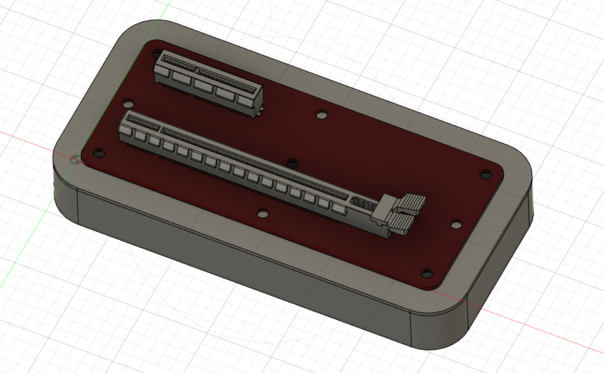
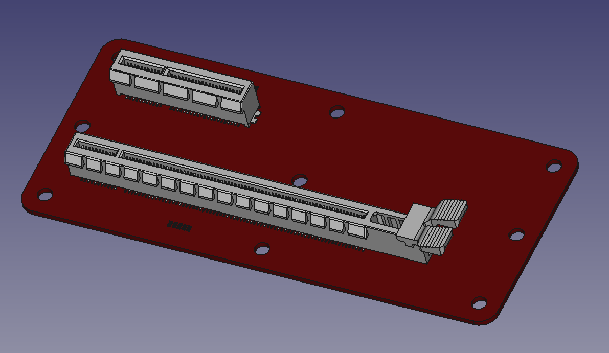
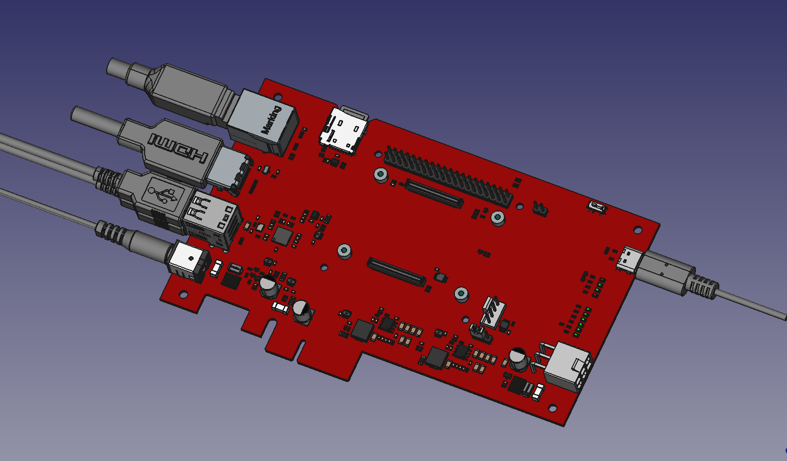
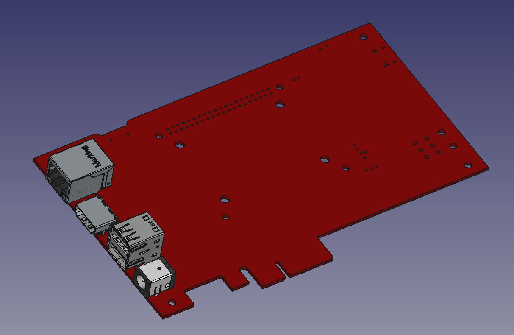

Here you can download 3D STEP models of PCB boards and other parts:

PCIE_X4_X16_ADP_stand_v1.stl -> simple stand for test setup (v1)

PCIE_X4_X16_ADP_V1_STEP_3D_2022-12-20.7z -> PCIe X4-X16 adapter (PCB + all the components)

Pi4GPU_v1_3D_model_20221129_full.7z -> (PCB + all the components)

Pi4GPU_v1_3D_model_20221129_conn_only.7z -> (PCB + only front connectors)

