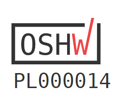

## PCB project

Here the design files (schematic, PCB, BOM) can be viewed by using interactive service (Altium 365 platform):
https://365.altium.com/files/16D52066-6CA6-4288-87DA-874B35C8B3C8

## License

Project published as Open Source Hardware (OSHW) under CERN OHL v1.2 (Open Hardware License).

Project (v1) has been certified as Open Source Hardware by the Open Source Hardware Association (OSHWA).

UID is (v1): PL000014

https://certification.oshwa.org/pl000014.html
